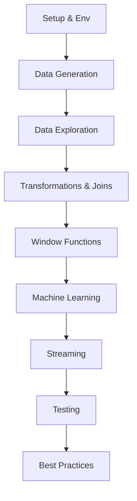

# Enterprise PySpark Cheatsheet & Quick Reference

<div align="center">
  
  <h2>Enterprise PySpark: Fast, Practical Reference</h2>
  <a href="https://opensource.org/licenses/Apache-2.0"></a>
</div>

---

## Who is this for?
- Data engineers, analysts, and developers needing fast PySpark reference
- Freshers and professionals who want quick, practical code patterns
- Anyone who wants to copy/paste, adapt, and run PySpark code for enterprise use

---

## How to use this cheatsheet
- Use the [Getting Started Guide](docs/getting-started.md) for setup and first run
- Use the [Full Workflow Example](docs/academy_start_here.md) for a reference pipeline
- Scan the roadmap and code snippets below for the pattern you need
- Jump to any script or section as needed—no step-by-step required
- Use the FAQ and Glossary for instant answers

---

## Quick Reference Map



---

## Reference Order (Recommended)
1. [Setup PySpark](src/setup_pyspark.py)
2. [Generate Data](src/data_generator.py)
3. [Explore Data](src/pyspark_analysis_examples.py) (exploration section)
4. [Transform & Join](src/pyspark_analysis_examples.py)
5. [Window Functions](src/pyspark_analysis_examples.py)
6. [Machine Learning](src/pyspark_analysis_examples.py)
7. [Streaming](src/pyspark_analysis_examples.py)
8. [Testing](tests/test_spark_session.py)
9. [Best Practices](docs/getting-started.md)

---

## What you can do with this project
- Instantly set up a PySpark environment
- Generate realistic enterprise datasets
- Run and adapt code for:
  - Data exploration
  - Transformations and joins
  - Window functions
  - Machine learning (regression, clustering, classification)
  - Streaming analytics
- Test your Spark code
- Apply enterprise best practices

---

## Example: SparkSession & DataFrame
```python
from src.pyspark_init import get_spark_session
spark = get_spark_session(app_name="QuickStart")
df = spark.read.parquet("sample_data/sales.parquet")
df.show()
```

## Example: Aggregation
```python
from pyspark.sql import functions as F
sales = spark.read.parquet("sample_data/sales.parquet")
monthly = sales.groupBy(F.year("transaction_date").alias("year"), F.month("transaction_date").alias("month")).agg(F.sum("total").alias("revenue"))
monthly.show()
```

---

## FAQ
**Q: Do I need Hadoop or Scala?**  
A: No. Python only.

**Q: Java error?**  
A: Check JAVA_HOME. See Troubleshooting in [docs/getting-started.md](docs/getting-started.md).

**Q: Windows/Linux/Mac?**  
A: Yes. Python 3.8+ and Java 8/11 required.

**Q: Where do I start?**  
A: [docs/getting-started.md](docs/getting-started.md) for setup. [docs/academy_start_here.md](docs/academy_start_here.md) for a full workflow example.

---

## Glossary
- **SparkSession**: Main entry point for Spark SQL.
- **DataFrame**: Table-like distributed data.
- **RDD**: Low-level distributed data structure.
- **Transformation**: Returns a new DataFrame.
- **Action**: Triggers computation.
- **Window Function**: Analytics over row groups.
- **Pipeline**: Chained data processing steps.
- **Partition**: Chunk of distributed data.

---

## Contact / Community
- [Open an Issue](https://github.com/yourusername/enterprise-pyspark/issues)
- [Stack Overflow: pyspark tag](https://stackoverflow.com/questions/tagged/pyspark)
- [Databricks Community](https://community.databricks.com/)

---

## Next Steps / Further Learning
- [Getting Started Guide](docs/getting-started.md)
- [Full Workflow Example](docs/academy_start_here.md)
- Explore real datasets
- Learn Spark on the cloud (AWS EMR, Databricks, GCP Dataproc)
- Contribute your own patterns

---

## Visual: Data Flow Example
```mermaid
flowchart LR
    style A fill:#f9f,stroke:#333,stroke-width:2px
    style G fill:#bbf,stroke:#333,stroke-width:2px
    A([🚀 Data Generation]):::start --> B([🔍 Data Exploration])
    B --> C([🔄 Transformations])
    C --> D([📊 Window Functions])
    D --> E([🤖 Machine Learning])
    E --> F([🌊 Streaming])
    F --> G([🧪 Testing]):::end

    classDef start fill:#f9f,stroke:#333,stroke-width:2px;
    classDef end fill:#bbf,stroke:#333,stroke-width:2px;
```

---

## Documentation Index
- [Getting Started Guide](docs/getting-started.md)
- [Full Workflow Example](docs/academy_start_here.md)
- API Reference, Best Practices, and Optimization sections coming soon.

---

<div align="center">
  <b>Enterprise PySpark: Copy, Adapt, Run. No Frills.</b>
</div> 